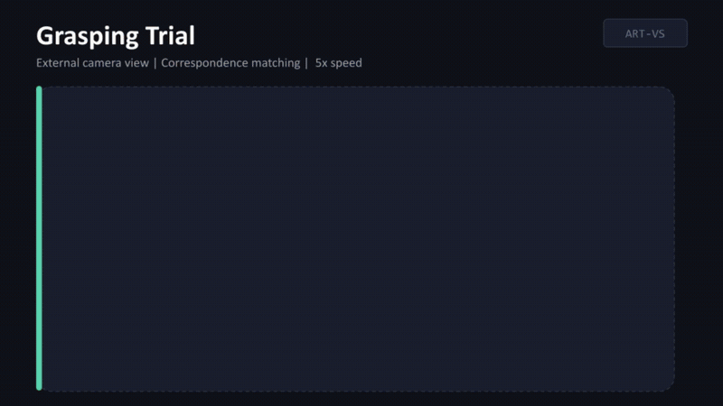
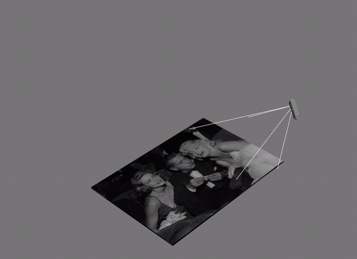

# ART-VS: Adaptive Resolution Tiling for Vision Transformer Visual Servoing

<div align="center">

[](https://art-vs.github.io/)
[](https://arxiv.org/abs/2606.19089)
[](https://art-vs.github.io/)
[](LICENSE)

</div>

<div align="center">



<sub><b>Real robot:</b> ART-VS servoing to grasp an unseen transparent bottle from a single reference image. More videos on the <a href="https://art-vs.github.io/">project page</a>.</sub>

</div>

Code for our IROS 2026 paper. ART-VS is a training-free visual servoing method that varies
how much spatial detail it reads out of a Vision Transformer as the servo progresses. It
starts coarse, at the backbone's native resolution, which keeps the matching robust while
the camera is still far from the goal; once the error has dropped enough (τ = 0.20, about an
80% reduction) it switches to a tiled pass that matches features tile-by-tile for the final
precise alignment. The tiling is also what makes high-resolution images usable in the first
place: running a ViT on a full 1440×1080 frame is prohibitively slow for closed-loop control,
whereas tiles keep every forward pass at the backbone's native input size — full-resolution
precision at a practical control rate. No task-specific training, and it works with several
ViT backbones (DINOv2, DINOv3, AM-RADIO).

On the perturbed Hollywood-poster benchmark it converges ~95% of the time, roughly 19
points above plain ViT-based servoing and ~14 above running the ViT at full resolution,
at over 10× the effective FPS and lower VRAM than full-resolution processing. The numbers,
ablations and the real-robot grasping results are in the [paper](https://arxiv.org/abs/2606.19089).

ViT-VS ([arXiv:2503.04545](https://arxiv.org/abs/2503.04545)) is the main baseline and is
included here as the `dinov2_308_no_tiling` config.

If you use ART-VS in your research, please cite the paper ([Citing](#citing)).

## Setup — two containers

This section covers the **simulation benchmark** (ROS1 Noetic, fully containerised — the
real robot runs on ROS2, [see below](#running-it-on-a-real-robot)). You need Docker, plus
the NVIDIA Container Toolkit for the vision side. The pipeline runs as **two containers**
with distinct jobs, both launched from `docker/`:

| Container | Start it with | Role |
|---|---|---|
| **Simulation** (`viso_sim`) | `./buildandrun_simulation.sh` | Runs **Gazebo** — the poster world and the camera. Full Gazebo, no GPU needed. |
| **Vision** (`viso_vision_desktop` / `viso_vision_laptop`) | `./buildandrun_vision_50XX.sh` *(RTX 50XX)* or `./buildandrun_vision_40XX.sh` *(RTX 30XX/40XX)* | Runs the **ART-VS servoing** — PyTorch + the ViT backbones. Drives the sim over ROS. |

Each script builds its image and drops you inside that container. You run **both**: they share
the host network, so the servoing in the vision container drives the camera running in the
simulation container. Two things worth knowing up front:

- You **only build the catkin workspace in the simulation container** (`catkin_make`). The
  vision container has no custom ROS packages, so it needs no build — just run the Python.
- The two vision images differ only in the PyTorch CUDA wheel: a **4090 works with either**, a
  **5090 needs the 50XX image** (Blackwell needs CUDA 12.8). If unsure, use 50XX. More in
  [`docker/README.md`](docker/README.md). ViT backbones download themselves on first use.
  (No Docker? See [`requirements/`](requirements/).)

## Running the simulation benchmark

Open two terminals. Gazebo runs in the simulation container; ART-VS runs in the vision
container and connects to it.

**Terminal 1 — simulation container (Gazebo):**

```bash
cd docker && ./buildandrun_simulation.sh          # builds the image, drops you into viso_sim
# ...now inside the container:
cd /root/catkin_ws && catkin_make && source devel/setup.bash   # build the workspace (only here)
cd src/ibvs/src && ./run_ibvs.sh                  # launch Gazebo with the Hollywood poster
```

> **See the Gazebo window** (optional): the sim runs **headless** by default. On a machine with
> a display, either run `gzclient` in a second shell inside the `viso_sim` container to attach a
> GUI to the running sim, or edit `catkin_ws/ibvs/launch/ibvs.launch` and set the Gazebo
> `<include>`'s `gui` to `true` and `headless` to `false`. `buildandrun_simulation.sh` already
> forwards X11 (`xhost +local:docker` + `DISPLAY`) for local sessions; over plain SSH you'd need
> X forwarding.

**Terminal 2 — vision container (ART-VS servoing):**

```bash
cd docker && ./buildandrun_vision_50XX.sh         # or _40XX; drops you into the vision container
# ...now inside the container (no catkin_make needed here):
cd /root/vision_ws/src/ibvs/src/visual_servoing/experiments/paper_evaluation
./run_paper_test1_no_perturbation.sh --samples 10     # quick check, all 10 methods
./run_paper_test1_no_perturbation.sh --samples 500    # the full run
```

Terminal 2 spawns the poster into the running Gazebo and servos the simulated camera to the
goal. For a single method instead of all ten:

```bash
cd /root/vision_ws/src/ibvs/src/visual_servoing/experiments
python3 run_multi_model_experiment_with_hollywood.py \
  --config ../configs/hollywood_500_evaluation/config_dinov3_256_6x6_tiling.yaml \
  --models 99 --samples 10
```

### Available methods

All ten benchmark methods are YAML configs in `configs/hollywood_500_evaluation/`. They share
the same IBVS control law and differ only in how image features are matched:

- **Classical** — `sift`, `orb`, `akaze`: hand-crafted keypoint detectors (no deep features);
  the training-free classical IBVS baselines.
- **ViT-VS baseline** — `dinov2_308_no_tiling`: a single-pass DINOv2 at its native 308 px, no
  tiling. This is [ViT-VS](https://arxiv.org/abs/2503.04545), our main baseline.
- **Full-resolution ViT** — `dinov2_518_no_tiling`, `dinov3_1440_no_tiling`: the same
  single-pass idea run at a higher input resolution (518 / 1440 px) instead of tiling —
  accurate but slow and VRAM-heavy.
- **ART-VS (ours)** — `dinov2_224_7x7_tiling`, `dinov3_256_6x6_tiling`, `amradio_256_6x6_tiling`
  (+ a DINOv2 6×6): coarse native-resolution servoing, then an **N×N** tiled high-resolution
  refinement. The number is the per-pass ViT resolution, `NxN` is the tiling grid — and the
  backbone (DINOv2 / DINOv3 / AM-RADIO) is swappable.

### Evaluation setup — perturbed initial poses

Every trial starts the camera from a different pose sampled in a box around the poster, and the
perturbation runs additionally jitter the poster's appearance (colour, random erasing, blur).
The perturbed posters are regenerated deterministically (seed 489) in the **vision** container
(it needs PyTorch); then run with the `--perturbation` variant:

```bash
# in the vision container:
cd /root/vision_ws/src/ibvs && python3 generate_perturbed_hollywood.py --num-models 500
cd src/visual_servoing/experiments/paper_evaluation
./run_paper_test1_with_perturbation.sh --samples 500
```

<div align="center">



<sub>Demo of the perturbed initial-pose sampling in Gazebo — a few examples of the 500 evaluation poses.</sub>

</div>

Results come out as `.npz`; `unified_eval.py` turns them into a table:

```bash
cd /root/vision_ws/src/ibvs/src/visual_servoing/experiments
python3 unified_eval.py paper_evaluation/results/**/results_*.npz --table
```

## Running it on a real robot

The real-robot side runs on **ROS2 Jazzy with MoveIt2 + MoveIt Servo** (the simulation
benchmark above stays on ROS1 Noetic — the vision package supports both). The controller
publishes a Cartesian camera velocity as `geometry_msgs/TwistStamped` to
`/servo_node/delta_twist_cmds`, and MoveIt Servo takes care of the Jacobian, singularities
and joint limits — so any arm with a MoveIt2 config can consume the commands. The interface:

- **in:** color + aligned depth `sensor_msgs/Image` on `camera_rgb_topic` / `camera_depth_topic`,
  plus a `base -> tool -> camera` TF tree
- **out:** `TwistStamped` (~100 Hz, current timestamps — Servo rejects stale ones) on
  `velocity_topic`

The code we ran the paper's grasping evaluation with is included:
[`catkin_ws/ibvs/src/robot/`](catkin_ws/ibvs/src/robot/) has the MoveIt interface, the
camera/cropper nodes, the Robotiq gripper driver and the grasping evaluation script
(`run_real_robot_evaluation.py`), and `configs/real_robot/` has the exact configs, goal
image and mask. Entry point:

```bash
cd catkin_ws/ibvs/src/visual_servoing
python3 run_visual_servoing.py --config configs/real_robot/config_real_robot_dinov3.yaml
```

Full setup (install, URCap, the five-terminal startup sequence, debugging) is in
[`docs/REAL_ROBOT.md`](docs/REAL_ROBOT.md).

## Citing

If ART-VS is useful, please cite the preprint (the paper is accepted at IROS 2026, but the
proceedings are not out yet):

```bibtex
@article{scherl2026artvs,
  title   = {ART-VS: Adaptive Resolution Tiling for Vision Transformer Visual Servoing},
  author  = {Scherl, Alessandro and Neuberger, Bernhard and Schwaiger, Simon and
             Mulero-P{\'e}rez, David and Muster, Lucas and Garc{\'i}a-Rodr{\'i}guez, Jos{\'e}},
  journal = {arXiv preprint arXiv:2606.19089},
  year    = {2026}
}
```

It also stands on a lot of other people's work. If you use a particular backbone, detector
or tracker, please cite the original too:
DINOv2 ([2304.07193](https://arxiv.org/abs/2304.07193)),
DINOv3 ([2508.10104](https://arxiv.org/abs/2508.10104)),
AM-RADIO ([2312.06709](https://arxiv.org/abs/2312.06709)),
YOLO-World ([2401.17270](https://arxiv.org/abs/2401.17270)),
LightTrack ([2104.14545](https://arxiv.org/abs/2104.14545)),
SAM ([2304.02643](https://arxiv.org/abs/2304.02643), via [LangSAM](https://github.com/luca-medeiros/lang-segment-anything)),
and the classical detectors SIFT (Lowe, IJCV 2004), ORB (Rublee et al., ICCV 2011) and
AKAZE (Alcantarilla et al., BMVC 2013).

<details>
<summary>BibTeX for all of the above</summary>

```bibtex
@article{oquab2024dinov2,
  title={DINOv2: Learning Robust Visual Features without Supervision},
  author={Oquab, Maxime and Darcet, Timoth\'ee and Moutakanni, Th\'eo and others},
  journal={Transactions on Machine Learning Research},
  year={2024},
  note={arXiv:2304.07193}
}

@article{simeoni2025dinov3,
  title={DINOv3},
  author={Sim\'eoni, Oriane and others},
  journal={arXiv preprint arXiv:2508.10104},
  year={2025}
}

@inproceedings{ranzinger2024amradio,
  title={{AM-RADIO}: Agglomerative Vision Foundation Model -- Reduce All Domains Into One},
  author={Ranzinger, Mike and Heinrich, Greg and Kautz, Jan and Molchanov, Pavlo},
  booktitle={IEEE/CVF Conference on Computer Vision and Pattern Recognition (CVPR)},
  year={2024}
}

@inproceedings{cheng2024yoloworld,
  title={{YOLO-World}: Real-Time Open-Vocabulary Object Detection},
  author={Cheng, Tianheng and Song, Lin and Ge, Yixiao and Liu, Wenyu and Wang, Xinggang and Shan, Ying},
  booktitle={IEEE/CVF Conference on Computer Vision and Pattern Recognition (CVPR)},
  year={2024}
}

@inproceedings{yan2021lighttrack,
  title={{LightTrack}: Finding Lightweight Neural Networks for Object Tracking via One-Shot Architecture Search},
  author={Yan, Bin and Peng, Houwen and Wu, Kan and Wang, Dong and Fu, Jianlong and Lu, Huchuan},
  booktitle={IEEE/CVF Conference on Computer Vision and Pattern Recognition (CVPR)},
  year={2021}
}

@inproceedings{kirillov2023sam,
  title={Segment Anything},
  author={Kirillov, Alexander and Mintun, Eric and Ravi, Nikhila and Mao, Hanzi and Rolland, Chloe and Gustafson, Laura and Xiao, Tete and Whitehead, Spencer and Berg, Alexander C. and Lo, Wan-Yen and Doll{\'a}r, Piotr and Girshick, Ross},
  booktitle={IEEE/CVF International Conference on Computer Vision (ICCV)},
  year={2023}
}

@article{lowe2004sift,
  title={Distinctive Image Features from Scale-Invariant Keypoints},
  author={Lowe, David G.},
  journal={International Journal of Computer Vision},
  year={2004}
}

@inproceedings{rublee2011orb,
  title={{ORB}: An Efficient Alternative to {SIFT} or {SURF}},
  author={Rublee, Ethan and Rabaud, Vincent and Konolige, Kurt and Bradski, Gary},
  booktitle={International Conference on Computer Vision (ICCV)},
  year={2011}
}

@inproceedings{alcantarilla2013akaze,
  title={Fast Explicit Diffusion for Accelerated Features in Nonlinear Scale Spaces},
  author={Alcantarilla, Pablo F. and Nuevo, Jes{\'u}s and Bartoli, Adrien},
  booktitle={British Machine Vision Conference (BMVC)},
  year={2013}
}
```

</details>

## License

MIT, see [`LICENSE`](LICENSE). Third-party components are listed in
[`THIRD_PARTY_LICENSES.md`](THIRD_PARTY_LICENSES.md).
